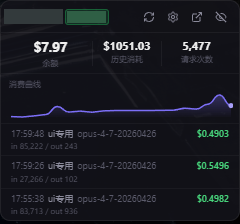
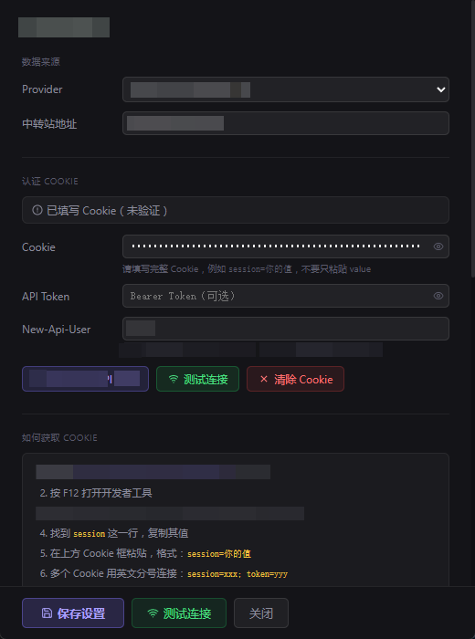

# API Relay Monitor 项目报告

## 一、项目概述

**API Relay Monitor**（仓库内代号 `api-monitor`）是一个面向 Windows 桌面的轻量级 API 中转站监控工具，提供常驻悬浮窗、系统托盘以及消费曲线，帮助开发者实时掌握中转账户的余额、累计消耗、请求次数与最近调用日志。

- 仓库地址：<https://github.com/xaokat080088-source/api-relay-monitor>
- License：MIT
- 平台：Windows 10 / 11（其他平台未测试）

## 二、技术栈

| 层 | 技术 |
| --- | --- |
| 桌面壳层 | Tauri v2（Rust） |
| 前端 UI | React 18 + TypeScript |
| 构建 | Vite 5 |
| 网络/解析 | reqwest（rustls）+ serde_json |
| 打包 | NSIS（x64） |
| 系统能力 | tray-icon / autostart / notification / shell |

## 三、功能特性

- 桌面悬浮窗（无边框、可拖动、可置顶、半透明）
- 系统托盘菜单（显示 / 刷新 / 设置 / 退出）
- 实时余额、历史消耗、请求次数显示
- 最近请求日志（模型名、token 用量、消费金额）
- Canvas 消费曲线，支持鼠标 hover tooltip
- Cookie / API Token / New-Api-User 三种认证方式
- 低余额系统通知
- Windows 开机自启动
- 历史记录本地持久化（最多 200 条）
- 内置 Mock Provider 用于本地预览，无需联网

## 四、应用截图

### 桌面悬浮窗



### 设置页面



## 五、项目结构

```text
src/
  renderer/
    App.tsx                  入口路由（悬浮窗 / 设置页）
    types.ts                 数据模型与默认设置
    components/
      FloatingWindow.tsx     悬浮窗 UI
      SettingsWindow.tsx     设置页 UI
      TrendChart.tsx         消费曲线
    services/
      balanceService.ts      自动刷新调度
      historyStore.ts        历史记录读写
      alertService.ts        低余额通知
      tauriAPI.ts            Tauri command 封装
      provider/              Provider 抽象（mock + 示例适配器）
src-tauri/
  src/
    lib.rs                   入口、托盘、窗口
    commands.rs              Tauri command（含示例 fetch）
    store.rs                 设置 / 历史持久化
    credential_store.rs      Cookie 本地存储
  tauri.conf.json
  Cargo.toml
```

## 六、Provider 适配机制

项目内置一个示例 Provider，按 New API / One API 兼容站点的常见接口字段实现：

- 用户信息：`/api/user/self`，字段 `quota` / `used_quota` / `request_count`
- 请求日志：`/api/log/self`，字段 `model_name` / `prompt_tokens` / `completion_tokens` / `quota`
- 认证头：`Cookie` / `Authorization: Bearer` / `New-Api-User`
- quota → USD 换算系数 `QUOTA_TO_USD = 500_000`

不同中转站接口规范不一，使用者需在 `src-tauri/src/commands.rs` 与 `src/renderer/services/provider/xiaoma.ts` 中根据实际站点调整路径与字段映射。

## 七、构建与发布

- 开发：`npm install` + `npm run dev`
- 类型检查：`npm run typecheck`
- 渲染层构建：`npm run build:renderer`
- 完整打包：`npm run build` → 输出 NSIS 安装包于 `src-tauri/target/release/bundle/nsis/`

## 八、安全与隐私

- Cookie / API Token 仅保存于本机 AppData 目录，不上传任何服务器
- `.gitignore` 已排除 `settings.json` / `history.json` / `session.json` / `.env` 等本地文件
- 默认 Provider 为 `mock`，初始 baseUrl / 凭据全部为空，开箱即用且不会触发真实接口请求

## 九、Release

- v1.0.0：首个公开版本，附带 Windows x64 NSIS 安装包

---

# API Relay Monitor — Project Report (English)

## 1. Overview

**API Relay Monitor** is a lightweight Windows desktop tool for monitoring API relay accounts. It provides a always-on-top floating window, a tray icon, and a usage chart so developers can keep an eye on the remaining balance, accumulated cost, request count, and recent call logs of their relay account.

- Repository: <https://github.com/xaokat080088-source/api-relay-monitor>
- License: MIT
- Platforms: Windows 10 / 11 (other platforms untested)

## 2. Tech Stack

| Layer | Technology |
| --- | --- |
| Desktop shell | Tauri v2 (Rust) |
| UI | React 18 + TypeScript |
| Bundler | Vite 5 |
| Networking / parsing | reqwest (rustls) + serde_json |
| Packaging | NSIS (x64) |
| System integration | tray-icon / autostart / notification / shell |

## 3. Features

- Frameless, draggable, semi-transparent floating window with always-on-top
- System tray menu (show / refresh / settings / quit)
- Live display of balance, total cost, and request count
- Recent request logs (model name, token usage, cost)
- Canvas-based cost trend chart with hover tooltip
- Cookie / API Token / New-Api-User authentication options
- Low balance system notification
- Windows auto-launch on boot
- Local history persistence (last 200 records)
- Built-in mock provider for offline preview

## 4. Screenshots

### Floating window


### Settings window


## 5. Project Structure

```text
src/
  renderer/
    App.tsx                  Router entry (floating / settings)
    types.ts                 Data models and default settings
    components/              Floating window, settings, chart
    services/                Balance refresh, history, alerts, providers
src-tauri/
  src/
    lib.rs                   Entry, tray, windows
    commands.rs              Tauri commands (incl. sample fetch)
    store.rs                 Settings / history persistence
    credential_store.rs      Local cookie storage
  tauri.conf.json
  Cargo.toml
```

## 6. Provider Adapter

An example provider is shipped, targeting New API / One API compatible relay sites:

- User info: `/api/user/self`, fields `quota` / `used_quota` / `request_count`
- Logs: `/api/log/self`, fields `model_name` / `prompt_tokens` / `completion_tokens` / `quota`
- Auth headers: `Cookie` / `Authorization: Bearer` / `New-Api-User`
- Quota → USD conversion: `QUOTA_TO_USD = 500_000`

Different relay sites expose different schemas. Users are expected to adjust paths and field mappings in `src-tauri/src/commands.rs` and `src/renderer/services/provider/xiaoma.ts` to match their target site.

## 7. Build & Release

- Develop: `npm install` then `npm run dev`
- Type check: `npm run typecheck`
- Renderer build: `npm run build:renderer`
- Full bundle: `npm run build` → NSIS installer under `src-tauri/target/release/bundle/nsis/`

## 8. Security & Privacy

- Cookies and tokens are stored only in the local AppData folder and never leave the machine
- `.gitignore` already excludes `settings.json`, `history.json`, `session.json`, `.env`, etc.
- The default provider is `mock` with empty baseUrl / credentials, so the app runs out of the box without contacting any real endpoint

## 9. Release

- v1.0.0: first public release with a Windows x64 NSIS installer attached
